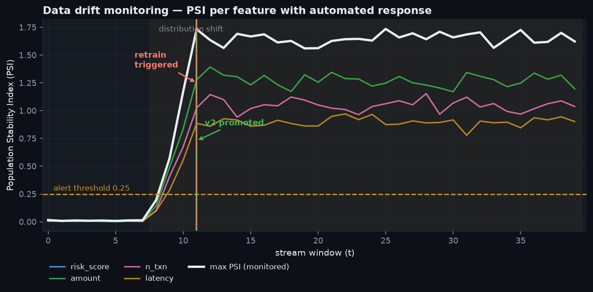
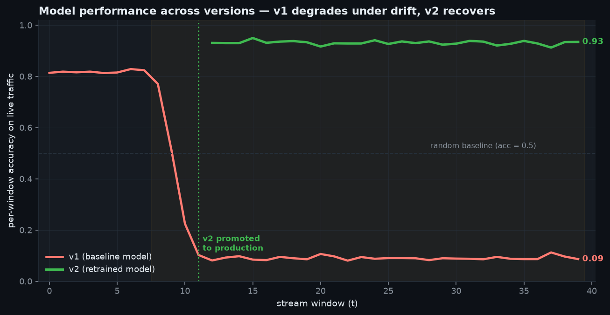
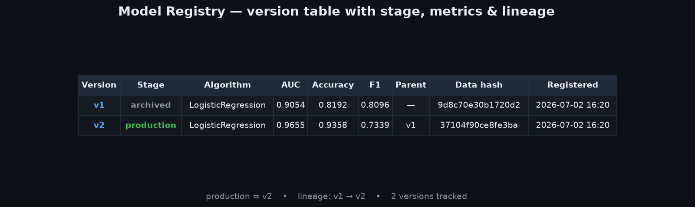
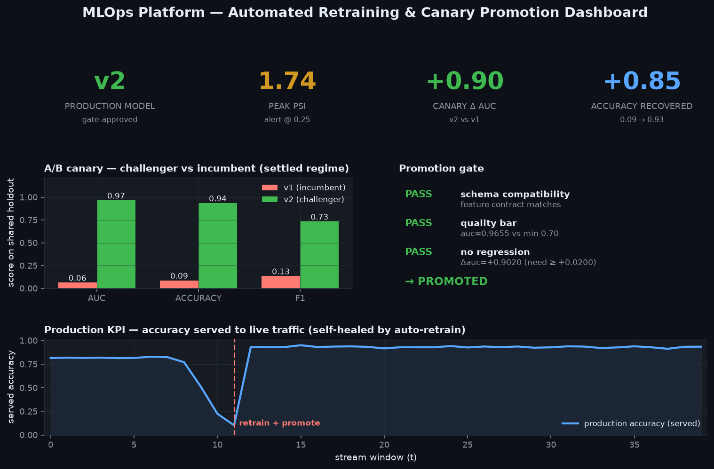

# MLOps Platform — Registry, Drift Monitoring & Automated Retraining

A single, offline, fully-deterministic library that implements the **closed-loop
model lifecycle** a production ML platform runs on:

```
train v1 → deploy to production → score a live stream → distribution shifts
   → drift detected → auto-retrain v2 → A/B canary → CI/CD gate passes
   → promote v2 → archive v1
```

Every component is real and importable — a DuckDB-backed **model registry** with a
validated stage state-machine, **experiment tracking**, **PSI/KL drift
monitoring**, a **retraining orchestrator** with shadow/canary A-B comparison, and
a **CI/CD promotion gate**. No external services, no paid APIs, no mocks in the
core logic. `make run` executes the whole lifecycle; `make test` proves the
behaviour.

---

## Highlights (numbers the code actually produced)

| What | Result |
|---|---|
| Lifecycle | v1 (AUC **0.905**) deployed → drift → v1 accuracy collapses **0.81 → 0.09** → auto-retrain → v2 promoted → v1 archived |
| Drift detection | worst-feature **PSI peaks at 1.74** (alert threshold 0.25); retrain fires only after **3 sustained** windows |
| A/B canary | challenger **v2 AUC 0.97** vs incumbent **v1 AUC 0.06** on the settled regime (**Δ +0.90**) |
| Gate | 3/3 checks pass (schema, quality bar, no-regression ≥ +0.02 margin) |
| Self-healing | served accuracy recovers **0.09 → 0.93** the window after promotion |
| Scale | **10M rows** scored + drift-monitored in **6.5 s (~1.55M rows/s)**, bounded memory |
| Tests | **27 passing** (registry transitions, PSI rise, trigger threshold, gate block/pass, lineage) |

---

## Screenshots

All four are rendered by `make screenshots` from the real run — nothing is mocked.

### Drift monitoring timeline
PSI per feature over the live stream; the retrain trigger and v2 promotion are
annotated at the window they fired.



### Model performance across versions
v1 (trained on the old concept) degrades to near-random as the boundary rotates;
v2, retrained on the new regime, recovers full accuracy.



### Model registry — table view
Versioned models with stage, metrics and lineage, rendered from the DuckDB registry.



### A/B canary + KPI dashboard
Canary comparison, the promotion-gate verdict, and the served-accuracy KPI that
self-heals after the automated promotion.



---

## Quickstart

```bash
make run          # end-to-end lifecycle simulation (writes data/*.json, *.csv)
make screenshots  # render the 4 dashboards into assets/
make test         # 27 behavioural tests
make bench        # scoring/monitoring scaling sweep (1M / 10M rows)
```

No installation needed if the shared stack (numpy/pandas/sklearn/duckdb/…) is
present; otherwise `make setup`.

---

## Architecture at a glance

| Module | Responsibility |
|---|---|
| `mlops.registry` | DuckDB-backed versioned registry; stage state-machine; promote/rollback; lineage |
| `mlops.tracking` | Experiment run log (params/metrics/artifacts); query & compare |
| `mlops.drift` | `DriftMonitor` (PSI/KL per feature) + `PerformanceMonitor` (rolling accuracy) |
| `mlops.gate` | `PromotionGate`: schema compat, quality bar, no-regression margin |
| `mlops.orchestrator` | Trigger policy → retrain (lineage) → canary A/B → gate → promote/hold |
| `mlops.model` / `mlops.data` | Real sklearn pipeline; synthetic data with covariate + concept drift knobs |

The lifecycle, thresholds and design trade-offs — plus how the registry and
monitoring scale to **many models and 1B-row scoring** — are documented in
[ARCHITECTURE.md](ARCHITECTURE.md).

### Reproducibility
Everything is seeded (`mlops.config.seed_everything`). The same run produces the
same versions, metrics, drift curve and promotion decision every time.
