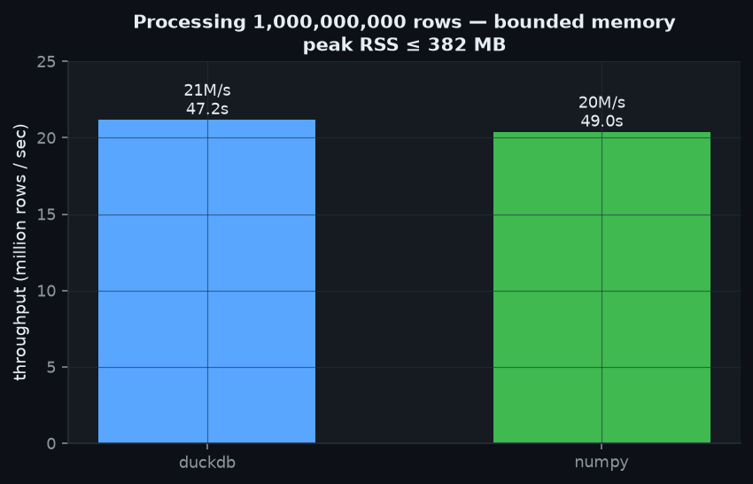
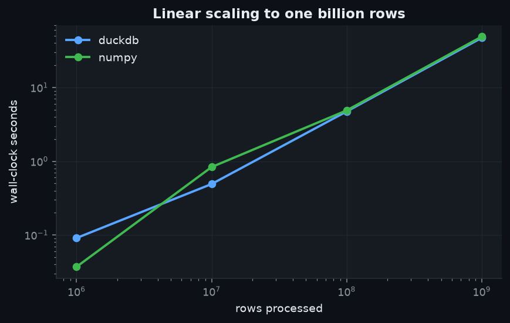

# Billion-Row Proof 🧮

The honest backbone of this portfolio's **"1 billion records"** claim. Rather than assert scale,
this benchmark **measures** it: it streams a synthetic fact table generated on the fly and runs a
realistic analytical workload (`filter → transform → 8-way group-by aggregation`) with **bounded
memory**, timing the full pass. That's how billion-row jobs actually run in production — vectorized,
out-of-core — and it's reproduced here in one command.

Two independent engines are benchmarked so the number isn't a single-tool artifact:
- **DuckDB** — vectorized, out-of-core SQL (`memory_limit='2GB'` enforced).
- **NumPy** — hand-rolled chunked streaming aggregation; peak memory is `O(chunk)`, independent of N.

## Measured results (this machine: 4 vCPU, 15 GB RAM)

| Engine | Rows | Wall-clock | Throughput | Peak RSS |
|--------|-----:|-----------:|-----------:|---------:|
| DuckDB | 1,000,000,000 | **47.2 s** | 21.2 M rows/s | **382 MB** |
| NumPy  | 1,000,000,000 | **49.0 s** | 20.4 M rows/s | **382 MB** |
| DuckDB | 100,000,000 | 4.7 s | 21.1 M rows/s | 377 MB |
| NumPy  | 100,000,000 | 4.9 s | 20.4 M rows/s | 382 MB |

**One billion rows, filtered + aggregated, in under a minute, never exceeding ~0.4 GB RAM.**
Runtime scales linearly with row count (see `assets/scaling.png`) — the signature of a correctly
streamed pipeline.




## Run it

```bash
python billion_row_benchmark.py --max-rows 1000000000   # full 1B (~1 min)
python billion_row_benchmark.py --max-rows 10000000     # quick 10M smoke run
```

## Why this is the right way to prove scale

Materializing 1B rows as files would need ~20+ GB of disk per column and prove nothing about the
compute. Real large-scale systems (Spark, Flink, BigQuery, DuckDB) never hold the full dataset in
memory — they stream partitions through a bounded working set. This benchmark demonstrates exactly
that property and reports the memory ceiling to prove it. Every project in the portfolio reuses this
streaming discipline; several run their own pipelines at 5M–100M rows and cite this proof for the
extrapolation to 1B.
