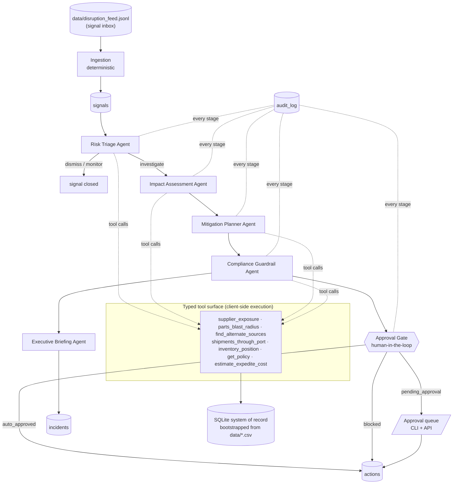

# Architecture

Sentinel SCM is an **agentic pipeline**, not a RAG system: instead of retrieving
documents to answer questions, a corps of specialized Claude agents *acts* —
querying the operational system of record through typed tools, reasoning over
the results, and producing governed, auditable decisions.

## System overview

## Design decisions

### Manual agentic loop, not the SDK tool runner
The orchestrator runs the Claude tool-use loop by hand (`sentinel/llm.py`).
This is deliberate: every tool call passes through a single chokepoint where it
is logged, audited, and counted against the run token budget. The harness —
not the model — owns the security boundary.

### Two backends, one contract
Every agent implements both `build_prompt()` (live Claude) and `simulate()`
(deterministic logic grounded in the same tools). The orchestrator is
backend-agnostic. Consequences:

- CI, tests, and the demo run **offline at zero cost**.
- The simulation doubles as a behavioral spec for the live agents — both paths
  must produce the same JSON schema.
- Flipping `SENTINEL_LLM_BACKEND=anthropic` upgrades reasoning quality without
  touching pipeline code.

### Governance is code, not prompts
Agents *propose*; the orchestrator *disposes*. Hard rules in
`Pipeline._register_actions` are enforced regardless of model output:

| Condition | Outcome |
|---|---|
| Compliance verdict `fail` | action **blocked** |
| Verdict `needs_review` or value > auto-approve limit | **pending human approval** |
| Verdict `pass` and value ≤ limit | auto-approved |

A prompt-injected or hallucinating agent cannot move money: the gate reads the
persisted compliance verdict and the configured limit, never the narrative.

### Budgets and blast-radius limits
- `SENTINEL_RUN_TOKEN_BUDGET` aborts a live run that overconsumes.
- `max_agent_iterations` caps each agent's loop.
- Graph walks in the impact stage are bounded (top suppliers / parts) so a
  large disruption cannot fan out into unbounded tool calls.

### Everything in the repo
Suppliers, parts, BOM, inventory, shipments, POs, the policy document, and the
disruption feed are committed under `data/` and loaded into SQLite on demand.
No cloud dependencies, no credentials, no spend — by design, with clean seams
(`sentinel/db.py`, `sentinel/tools.py`) for swapping in warehouse connectors
and real event feeds later.

## Module map

| Module | Responsibility |
|---|---|
| `sentinel/config.py` | Settings (env-driven, safe defaults) |
| `sentinel/db.py` | SQLite bootstrap from `data/`, schema |
| `sentinel/tools.py` | Typed tool registry + client-side execution |
| `sentinel/llm.py` | Anthropic agentic loop, simulation marker, budgets |
| `sentinel/agents/` | The five specialist agents |
| `sentinel/orchestrator.py` | Pipeline, approval gate, audit trail |
| `sentinel/api.py` | FastAPI control plane |
| `sentinel/cli.py` | Operator CLI |
| `sentinel/telemetry.py` | Structured JSON logging, usage/cost metering |

## Scaling path

The local pieces are deliberately swappable:

1. **Data plane** — replace SQLite with Snowflake/BigQuery connectors behind
   the same tool functions.
2. **Signal ingestion** — replace the JSONL feed with webhooks/queues writing
   into `signals`.
3. **Workers** — `POST /runs` is synchronous today; move pipeline execution to
   a task queue and shard by signal.
4. **Approvals** — the queue is API-first; wire it to Slack/Teams/ServiceNow.
5. **Live agents** — turn on `anthropic` backend per-stage (e.g. keep triage in
   simulation, run impact/mitigation live) by extending `build_backend`.
